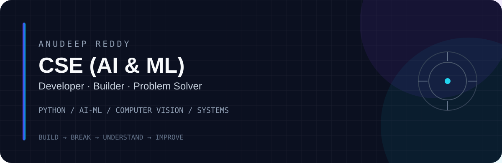
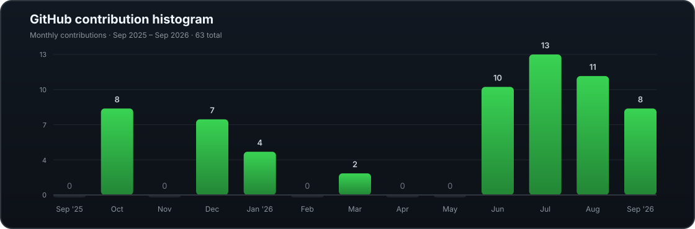

<picture>
  <source media="(prefers-color-scheme: dark)" srcset="./assets/hero-dark.svg">
  <source media="(prefers-color-scheme: light)" srcset="./assets/hero-light.svg">
  
</picture>

 

 

I'm a **CSE (AI & ML) student** who likes building things that move beyond a classroom demo.

My work sits around **Python, machine learning, computer vision, backend systems and problem solving**. I enjoy taking an idea from a rough prototype to something that actually works.

> **Build → break → understand → improve.**

---

## 📈 DAILY ACTIVITY

---

## ⭐ FEATURED PROJECTS

<table>
<tr>
<td width="50%" valign="top">

### 🕳️ Pothole Detection

YOLO-based computer vision project for detecting potholes from road imagery.

<a href="https://github.com/Anudeep-Reddy07/Pothole-Detection-Project">View Repository →</a>

</td>
<td width="50%" valign="top">

### 🚨 AI Emergency Decision Support

AI-oriented emergency decision-support project.

<a href="https://github.com/Anudeep-Reddy07/AI-Emergency-Decision-Support-System">View Repository →</a>

</td>
</tr>

<tr>
<td width="50%" valign="top">

### 🌱 Bloom — Local Prices

Web application built around local product and price information.

<a href="https://github.com/Anudeep-Reddy07/bloom-local-prices">View Repository →</a>

</td>
<td width="50%" valign="top">

### 🥾 Trekking Management

Role-based trekking management platform with authentication, bookings, caching and background tasks.

<a href="https://github.com/Anudeep-Reddy07/trekking-management-application">View Repository →</a>

</td>
</tr>

<tr>
<td width="50%" valign="top">

### 🏢 Placement Portal

Multi-role placement management application for students, companies and administrators.

<a href="https://github.com/Anudeep-Reddy07/Placement-portal-application">View Repository →</a>

</td>
<td width="50%" valign="top">

### 🏠 House Price Prediction

Machine-learning project focused on predicting house prices from structured data.

<a href="https://github.com/Anudeep-Reddy07/HousePricePrediction">View Repository →</a>

</td>
</tr>
</table>

---

## 📊 GITHUB STATS

 

---

## 🛠️ TECH STACK

<table>
<tr>
<td width="25%" valign="top">

### 🧠 AI & ML

- Python
- PyTorch
- YOLO / Ultralytics
- OpenCV
- Machine Learning

</td>
<td width="25%" valign="top">

### 💻 Development

- C
- Java
- Flask
- React
- Vue
- TypeScript
- Tailwind CSS

</td>
<td width="25%" valign="top">

### ⚙️ Backend & Systems

- REST APIs
- JWT Authentication
- Redis
- Celery
- GitHub Actions
- Docker

</td>
<td width="25%" valign="top">

### 🗄️ Data & Platforms

- SQLite
- PostgreSQL
- Supabase
- SQLAlchemy
- Git & GitHub
- Netlify

</td>
</tr>
</table>

---

### 🚀 LEARNING. BUILDING. ITERATING.

<a href="https://github.com/Anudeep-Reddy07">GitHub</a>
&nbsp;&nbsp;·&nbsp;&nbsp;
<a href="https://www.linkedin.com/in/anudeep-reddy-kakireddy/">LinkedIn</a>

  

Learning continuously. Building deliberately.

